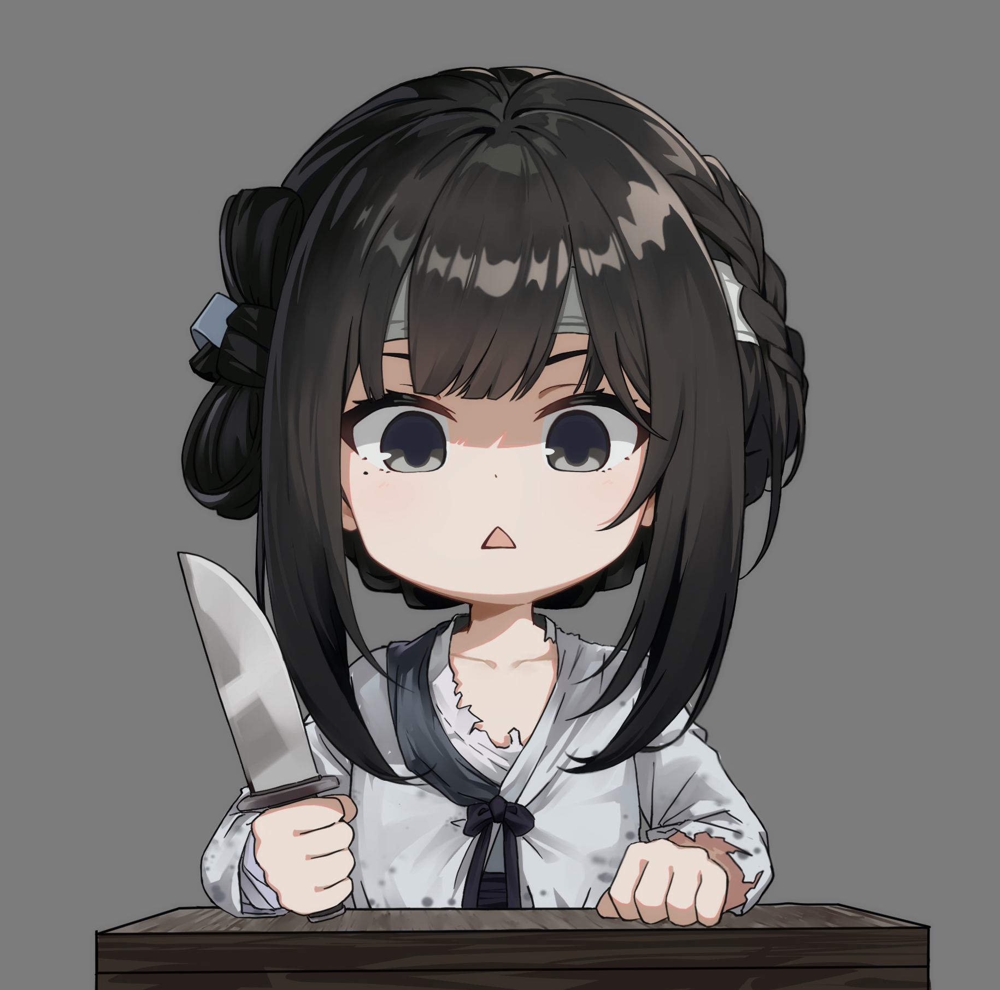

<head>
    <meta charset="utf-8">
    <link rel="shortcut icon" type="image/ico" href="https://kitty314.github.io/favicon.ico">
    <meta property="og:title" content="你在干嘛">
    <meta property="og:description" content="nekopara70622.github.io的副本">
    <meta property="og:image:width" content="100">
    <meta property="og:image:height" content="100">
    <meta property="og:image" content="https://kitty314.github.io/favicon.png">
    <meta property="og:url" content="https://kitty314.github.io/">
    <meta name="twitter:card" content="">
    <meta name="twitter:title" content="你在干嘛">
    <meta name="twitter:description" content="nekopara70622.github.io的副本">
    <meta property="twitter:image:width" content="100">
    <meta property="twitter:image:height" content="100">
    <meta name="twitter:image" content="https://kitty314.github.io/favicon.png">
    <meta name="twitter:url" content="https://kitty314.github.io/">
    <title>你在干嘛</title>
</head>
<body>
    

      <header>
        <h1><a href="https://kitty314.github.io/">nekopara70622's homepage <del>fake</del></a></h1>
        
kitty314 love love 🥰🥰🥰  If it looks like a neko, walks like a neko, and meows like a neko, then it probably is a neko.

        
<a href="https://github.com/kitty314">View My GitHub Profile</a>

      </header>
    

</body>

# 你在干嘛
> ### nekopara70622.github.io的副本

- zgm \
A. zcf \
B. zsj \
C. zkf \
D. zwl \
E. zgh \
F. zj \
G. zy \
H. ztg 

# How to respond to "what are you doing"?
- <https://www.wikihow.com/Respond-to-What-Are-You-Doing>  

"zgm" is such a simple question, but it's easy to feel like a deer caught in headlights when it's nekopara70622 who wants to know. Do you respond honestly? Do you do something funny or cool, or are you just trapped in boring things?  

